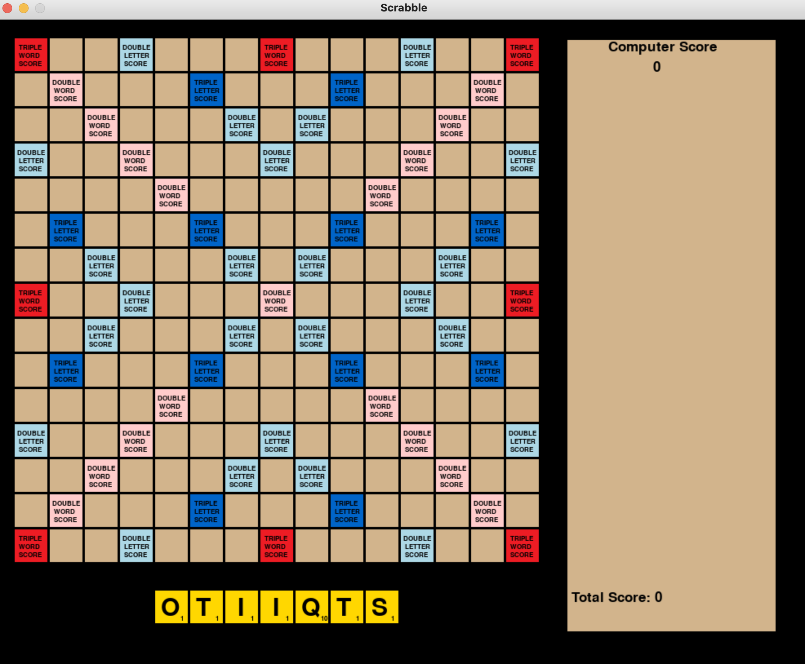
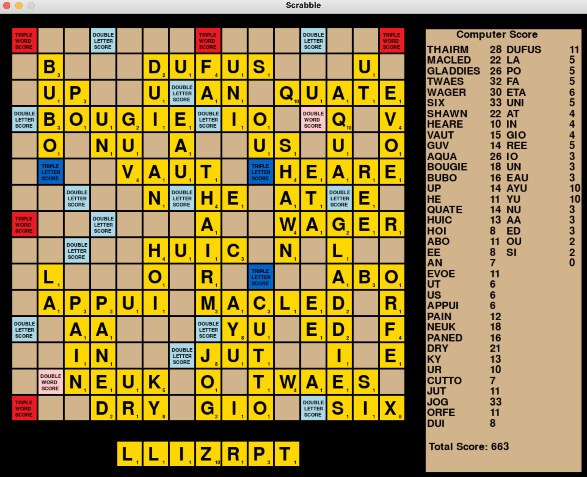

# Scrabble Solver

This is a Python implementation of a Scrabble Solver originally described in ["The World's Fastest Scrabble Program"](https://www.cs.cmu.edu/afs/cs/academic/class/15451-s06/www/lectures/scrabble.pdf) by Andrew Appel and Guy Jacobsen.

The solver uses a dictionary of 279,497 valid Scrabble words to select the highest-scoring word on any given board and rack of tiles. I've decided not to include the Collins Scrabble Dictionary that I used since it appears to be copyrighted, but it's easy enough to find online.

I discovered that a lot of strange and seemingly made-up words actually exist in the Scrabble dictionary. This is especially apparent with two-letter words, where words like "EE" and "AA" are allowed. These words allow the solver to score many additional points in the endgame when space for larger words has been eliminated. 

# References
For creating the Directed Acyclic Word Graph (DAWG), I referenced blog posts by [Steve Hanov](http://stevehanov.ca/blog/?id=115) and [Jean-Bernard Pellerin](https://jbp.dev/blog/dawg-basics.html).

For the word creation algorithm, I exclusively referenced the aforementioned ["World's Fastest Scrabble Program"](https://www.cs.cmu.edu/afs/cs/academic/class/15451-s06/www/lectures/scrabble.pdf)
